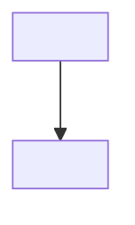

# Socrates Plugin Implementation Plan

> **For agentic workers:** REQUIRED SUB-SKILL: Use superpowers:subagent-driven-development (recommended) or superpowers:executing-plans to implement this plan task-by-task. Steps use checkbox (`- [ ]`) syntax for tracking.

**Goal:** Build and package Socrates as an installable Claude Code plugin: a `/socrates:teach <topic>` skill that probes current understanding, plans a fact-checked curriculum, and teaches one step at a time with applied-reasoning checks and self-checked visuals, plus a cosmetic startup banner scoped to active Socrates workspaces.

**Architecture:** A self-contained plugin directory (`.claude-plugin/plugin.json` + auto-discovered `skills/`, `hooks/`, `scripts/`). Two small, independently testable bash helpers (`resolve-config.sh`, `svg-check.sh`) carry the only real "logic"; the `teach` skill is a prose orchestration file that calls them via `Bash` and uses the built-in `AskUserQuestion` and `Agent` tools for calibration checks and sub-agents. A `SessionStart` hook prints an ASCII banner, but only inside a directory that is an active Socrates workspace (has `socrates.config.json` or a `socrates-notes/` folder) — never in unrelated Claude Code sessions.

**Tech Stack:** Bash, `jq`, `rsvg-convert` (librsvg), Claude Code plugin/skill/hook system, Claude Code built-in `AskUserQuestion`, `Agent`, `WebSearch`, `WebFetch`, `Read` tools.

**Spec:** `docs/superpowers/specs/2026-08-17-socrates-teach-design.md`

## Global Constraints

- All files (code, docs, comments, commit messages) are written in **English**.
- No hardcoded personal path or PARA structure — the vault path and notes root are always resolved via `socrates.config.json` in the working directory, never assumed. Without one, fall back to `./socrates-notes/`.
- The skill is plugin-namespaced: invoked as **`/socrates:teach <topic>`**, not `/teach`.
- `rsvg-convert` (`brew install librsvg`) is a required external dependency for visual self-checking; scripts must fail with a clear, actionable message if it's missing, not a raw stack trace.
- No personal vault content, session-log hooks, or autocommit hooks from the author's own vault are included in this plugin — it must work for anyone's vault or no vault at all.
- Every task ends with a **local** commit (standard iterative-implementation practice). Do **not** push to the GitHub remote at any point during task execution — publishing is a separate, explicit step the user triggers themselves (see "Publishing" at the end of this document).

---

## File Structure

```
socrates/
├── .claude-plugin/
│   ├── plugin.json              ← plugin manifest
│   └── marketplace.json         ← self-referencing marketplace, so `/plugin marketplace add <repo>` works
├── skills/
│   └── teach/
│       └── SKILL.md             ← probe→plan→teach orchestration
├── hooks/
│   ├── hooks.json                ← registers socrates-banner.sh on SessionStart
│   └── socrates-banner.sh
├── scripts/
│   ├── resolve-config.sh         ← finds socrates.config.json for a given directory
│   └── svg-check.sh              ← renders + validates an SVG via rsvg-convert
├── tests/
│   ├── test-manifests.sh
│   ├── test-resolve-config.sh
│   ├── test-svg-check.sh
│   └── test-banner-hook.sh
├── socrates.config.json.example
└── README.md
```

---

### Task 1: Plugin scaffold & manifests

**Files:**
- Create: `.claude-plugin/plugin.json`
- Create: `.claude-plugin/marketplace.json`
- Test: `tests/test-manifests.sh`

**Interfaces:**
- Produces: `.claude-plugin/plugin.json` with a `version` field (string, e.g. `"0.1.0"`) that Task 4's banner hook reads at runtime.

- [ ] **Step 1: Write the failing test**

```bash
#!/bin/bash
set -euo pipefail

SCRIPT_DIR="$(cd "$(dirname "${BASH_SOURCE[0]}")" && pwd)"
ROOT="$SCRIPT_DIR/.."

PLUGIN_JSON="$ROOT/.claude-plugin/plugin.json"
MARKETPLACE_JSON="$ROOT/.claude-plugin/marketplace.json"

jq empty "$PLUGIN_JSON"
echo "PASS: plugin.json is valid JSON"

NAME=$(jq -r '.name' "$PLUGIN_JSON")
if [ "$NAME" != "socrates" ]; then
  echo "FAIL: expected plugin name 'socrates', got '$NAME'"
  exit 1
fi
echo "PASS: plugin.json has correct name"

VERSION=$(jq -r '.version' "$PLUGIN_JSON")
if [ -z "$VERSION" ] || [ "$VERSION" = "null" ]; then
  echo "FAIL: plugin.json is missing a version field"
  exit 1
fi
echo "PASS: plugin.json has a version"

jq empty "$MARKETPLACE_JSON"
echo "PASS: marketplace.json is valid JSON"

PLUGIN_SOURCE=$(jq -r '.plugins[0].source' "$MARKETPLACE_JSON")
if [ "$PLUGIN_SOURCE" != "./" ]; then
  echo "FAIL: expected plugin source './', got '$PLUGIN_SOURCE'"
  exit 1
fi
echo "PASS: marketplace.json points to plugin root"

echo "ALL TESTS PASSED"
```

Save this as `tests/test-manifests.sh` and `chmod +x tests/test-manifests.sh`.

- [ ] **Step 2: Run test to verify it fails**

Run: `bash tests/test-manifests.sh`
Expected: FAIL — `.claude-plugin/plugin.json` does not exist yet (jq error, non-zero exit).

- [ ] **Step 3: Write the manifests**

`.claude-plugin/plugin.json`:
```json
{
  "name": "socrates",
  "displayName": "Socrates",
  "version": "0.1.0",
  "description": "A Socratic AI tutor for Claude Code: adaptive knowledge probing, fact-checked lesson planning, and step-by-step teaching with self-checked visuals.",
  "author": {
    "name": "Maikel Heijen"
  },
  "license": "MIT"
}
```

**Do not** add an explicit `"hooks"` field pointing at `./hooks/hooks.json`
here, even though that looks like it removes ambiguity. Claude Code
auto-loads `hooks/hooks.json` at its default path regardless; a manifest
field restating that same default path is treated as declaring a second,
*additional* hooks file, collides with the auto-loaded one, and the whole
plugin's hooks fail to register with a "Duplicate hooks file detected"
error (found via `--debug hooks` during Task 7's live testing — `claude
plugin validate` does not catch this). Likewise, omit `"skills": "./skills"`
— it's harmless (skills load fine either way, unlike hooks), but it's the
same restate-the-default pattern and removing it is free. Rely on
auto-discovery for both.

`.claude-plugin/marketplace.json`:
```json
{
  "name": "socrates",
  "description": "A Socratic AI tutor for Claude Code.",
  "owner": {
    "name": "Maikel Heijen"
  },
  "plugins": [
    {
      "name": "socrates",
      "source": "./",
      "description": "A Socratic AI tutor for Claude Code."
    }
  ]
}
```

- [ ] **Step 4: Run test to verify it passes**

Run: `bash tests/test-manifests.sh`
Expected: `ALL TESTS PASSED`

- [ ] **Step 5: Commit**

```bash
git add .claude-plugin tests/test-manifests.sh
git commit -m "feat: add plugin manifest and marketplace scaffold"
```

---

### Task 2: `resolve-config.sh` — workspace config resolution

**Files:**
- Create: `scripts/resolve-config.sh`
- Test: `tests/test-resolve-config.sh`

**Interfaces:**
- Produces: `scripts/resolve-config.sh <directory>` → prints one line of JSON to stdout: `{"vault": "<path>"|null, "notesRoot": "<string>", "source": "config"|"none"}`. Used by Task 4 (banner hook) and Task 5 (`teach` skill).
- Consumes: a `socrates.config.json` file (if present) with fields `{"vault": "<path>", "notesRoot": "<string>"}` in the target directory.

- [ ] **Step 1: Write the failing test**

```bash
#!/bin/bash
set -euo pipefail

SCRIPT_DIR="$(cd "$(dirname "${BASH_SOURCE[0]}")" && pwd)"
RESOLVE="$SCRIPT_DIR/../scripts/resolve-config.sh"

TMP=$(mktemp -d)
trap 'rm -rf "$TMP"' EXIT

# Case 1: no config file present -> fallback
OUTPUT=$("$RESOLVE" "$TMP")
EXPECTED='{"vault": null, "notesRoot": "socrates-notes", "source": "none"}'
if [ "$(echo "$OUTPUT" | jq -c -S .)" != "$(echo "$EXPECTED" | jq -c -S .)" ]; then
  echo "FAIL: expected fallback output, got: $OUTPUT"
  exit 1
fi
echo "PASS: fallback when no config"

# Case 2: config file present with vault + notesRoot
cat > "$TMP/socrates.config.json" <<'EOF'
{"vault": "/Users/test/vault", "notesRoot": "Resources"}
EOF
OUTPUT=$("$RESOLVE" "$TMP")
EXPECTED='{"vault": "/Users/test/vault", "notesRoot": "Resources", "source": "config"}'
if [ "$(echo "$OUTPUT" | jq -c -S .)" != "$(echo "$EXPECTED" | jq -c -S .)" ]; then
  echo "FAIL: expected config output, got: $OUTPUT"
  exit 1
fi
echo "PASS: reads config when present"

# Case 3: config file present without notesRoot -> default to "Resources"
cat > "$TMP/socrates.config.json" <<'EOF'
{"vault": "/Users/test/vault"}
EOF
OUTPUT=$("$RESOLVE" "$TMP")
NOTES_ROOT=$(echo "$OUTPUT" | jq -r '.notesRoot')
if [ "$NOTES_ROOT" != "Resources" ]; then
  echo "FAIL: expected default notesRoot 'Resources', got '$NOTES_ROOT'"
  exit 1
fi
echo "PASS: defaults notesRoot to Resources"

echo "ALL TESTS PASSED"
```

Save as `tests/test-resolve-config.sh`, `chmod +x`.

- [ ] **Step 2: Run test to verify it fails**

Run: `bash tests/test-resolve-config.sh`
Expected: FAIL — `scripts/resolve-config.sh` does not exist yet.

- [ ] **Step 3: Write minimal implementation**

```bash
#!/bin/bash
set -euo pipefail

TARGET_DIR="${1:-$PWD}"
CONFIG_FILE="$TARGET_DIR/socrates.config.json"

if [ -f "$CONFIG_FILE" ]; then
  VAULT=$(jq -r '.vault // empty' "$CONFIG_FILE")
  NOTES_ROOT=$(jq -r '.notesRoot // "Resources"' "$CONFIG_FILE")
  if [ -z "$VAULT" ]; then
    echo '{"vault": null, "notesRoot": "socrates-notes", "source": "none"}'
    exit 0
  fi
  jq -n --arg vault "$VAULT" --arg notesRoot "$NOTES_ROOT" \
    '{vault: $vault, notesRoot: $notesRoot, source: "config"}'
else
  echo '{"vault": null, "notesRoot": "socrates-notes", "source": "none"}'
fi
```

Save as `scripts/resolve-config.sh`, `chmod +x`.

- [ ] **Step 4: Run test to verify it passes**

Run: `bash tests/test-resolve-config.sh`
Expected: `ALL TESTS PASSED`

- [ ] **Step 5: Commit**

```bash
git add scripts/resolve-config.sh tests/test-resolve-config.sh
git commit -m "feat: add workspace config resolution script"
```

---

### Task 3: `svg-check.sh` — visual self-check helper

**Files:**
- Create: `scripts/svg-check.sh`
- Test: `tests/test-svg-check.sh`

**Interfaces:**
- Produces: `scripts/svg-check.sh <input.svg> <output.png>` → on success, prints the output PNG path to stdout and exits 0 (the `teach` skill's visualization sub-agent then views that path with the `Read` tool); on failure, prints a clear message to stderr and exits 1.
- Requires `rsvg-convert` on `PATH`.

- [ ] **Step 1: Write the failing test**

```bash
#!/bin/bash
set -euo pipefail

SCRIPT_DIR="$(cd "$(dirname "${BASH_SOURCE[0]}")" && pwd)"
SVG_CHECK="$SCRIPT_DIR/../scripts/svg-check.sh"
TMP=$(mktemp -d)
trap 'rm -rf "$TMP"' EXIT

cat > "$TMP/sample.svg" <<'EOF'
<svg xmlns="http://www.w3.org/2000/svg" width="10" height="10">
  <rect width="10" height="10" fill="black"/>
</svg>
EOF

OUTPUT_PATH=$("$SVG_CHECK" "$TMP/sample.svg" "$TMP/sample.png")
if [ "$OUTPUT_PATH" != "$TMP/sample.png" ]; then
  echo "FAIL: expected output path $TMP/sample.png, got $OUTPUT_PATH"
  exit 1
fi
if [ ! -s "$TMP/sample.png" ]; then
  echo "FAIL: PNG was not created or is empty"
  exit 1
fi
echo "PASS: valid SVG converts to non-empty PNG"

set +e
"$SVG_CHECK" "$TMP/does-not-exist.svg" "$TMP/out2.png" 2>"$TMP/err.log"
STATUS=$?
set -e
if [ "$STATUS" -eq 0 ]; then
  echo "FAIL: expected non-zero exit for missing input"
  exit 1
fi
if ! grep -q "not found" "$TMP/err.log"; then
  echo "FAIL: expected 'not found' error message, got: $(cat "$TMP/err.log")"
  exit 1
fi
echo "PASS: missing input fails with clear error"

echo "ALL TESTS PASSED"
```

Save as `tests/test-svg-check.sh`, `chmod +x`.

- [ ] **Step 2: Run test to verify it fails**

Run: `bash tests/test-svg-check.sh`
Expected: FAIL — `scripts/svg-check.sh` does not exist yet.

- [ ] **Step 3: Write minimal implementation**

```bash
#!/bin/bash
set -euo pipefail

if [ "$#" -ne 2 ]; then
  echo "Usage: svg-check.sh <input.svg> <output.png>" >&2
  exit 1
fi

INPUT="$1"
OUTPUT="$2"

if [ ! -f "$INPUT" ]; then
  echo "Error: input SVG not found: $INPUT" >&2
  exit 1
fi

if ! command -v rsvg-convert >/dev/null 2>&1; then
  echo "Error: rsvg-convert not found. Install it with: brew install librsvg" >&2
  exit 1
fi

ERR_LOG=$(mktemp)
if ! rsvg-convert "$INPUT" -o "$OUTPUT" 2>"$ERR_LOG"; then
  echo "Error: rsvg-convert failed: $(cat "$ERR_LOG")" >&2
  rm -f "$ERR_LOG"
  exit 1
fi
rm -f "$ERR_LOG"

if [ ! -s "$OUTPUT" ]; then
  echo "Error: output PNG is empty or missing: $OUTPUT" >&2
  exit 1
fi

echo "$OUTPUT"
```

Save as `scripts/svg-check.sh`, `chmod +x`.

- [ ] **Step 4: Run test to verify it passes**

Run: `bash tests/test-svg-check.sh`
Expected: `ALL TESTS PASSED`

- [ ] **Step 5: Commit**

```bash
git add scripts/svg-check.sh tests/test-svg-check.sh
git commit -m "feat: add SVG render-and-check helper script"
```

---

### Task 4: `SessionStart` banner hook

**Files:**
- Create: `hooks/socrates-banner.sh`
- Create: `hooks/hooks.json`
- Test: `tests/test-banner-hook.sh`

**Interfaces:**
- Consumes: `scripts/resolve-config.sh <cwd>` (Task 2, exact JSON shape above), `.claude-plugin/plugin.json`'s `version` field (Task 1).
- Produces: `hooks/socrates-banner.sh` reads a JSON object from stdin (the standard `SessionStart` hook payload, with a `.cwd` field) and prints the banner to stdout only when the directory is an active Socrates workspace; otherwise prints nothing and exits 0.

- [ ] **Step 1: Write the failing test**

```bash
#!/bin/bash
set -euo pipefail

SCRIPT_DIR="$(cd "$(dirname "${BASH_SOURCE[0]}")" && pwd)"
BANNER="$SCRIPT_DIR/../hooks/socrates-banner.sh"
TMP=$(mktemp -d)
trap 'rm -rf "$TMP"' EXIT

# Case 1: unrelated directory -> silent
OUTPUT=$(printf '{"cwd": "%s"}' "$TMP" | "$BANNER")
if [ -n "$OUTPUT" ]; then
  echo "FAIL: expected no banner output for unrelated cwd, got: $OUTPUT"
  exit 1
fi
echo "PASS: silent outside a Socrates workspace"

# Case 2: socrates.config.json present -> banner shown
mkdir -p "$TMP/withconfig"
cat > "$TMP/withconfig/socrates.config.json" <<'EOF'
{"vault": "/tmp/vault", "notesRoot": "Resources"}
EOF
OUTPUT=$(printf '{"cwd": "%s"}' "$TMP/withconfig" | "$BANNER")
if ! echo "$OUTPUT" | grep -q "socrates v"; then
  echo "FAIL: expected banner with version, got: $OUTPUT"
  exit 1
fi
echo "PASS: banner shown when socrates.config.json present"

# Case 3: fallback socrates-notes/ folder present -> banner shown
mkdir -p "$TMP/withnotes/socrates-notes"
OUTPUT=$(printf '{"cwd": "%s"}' "$TMP/withnotes" | "$BANNER")
if ! echo "$OUTPUT" | grep -q "socrates v"; then
  echo "FAIL: expected banner with version, got: $OUTPUT"
  exit 1
fi
echo "PASS: banner shown when socrates-notes/ already exists"

echo "ALL TESTS PASSED"
```

Save as `tests/test-banner-hook.sh`, `chmod +x`.

- [ ] **Step 2: Run test to verify it fails**

Run: `bash tests/test-banner-hook.sh`
Expected: FAIL — `hooks/socrates-banner.sh` does not exist yet.

- [ ] **Step 3: Write minimal implementation**

```bash
#!/bin/bash
set -euo pipefail

PLUGIN_ROOT="$(cd "$(dirname "${BASH_SOURCE[0]}")/.." && pwd)"
INPUT=$(cat)
CWD=$(echo "$INPUT" | jq -r '.cwd // empty')

if [ -z "$CWD" ] || [ ! -d "$CWD" ]; then
  exit 0
fi

CONFIG_INFO=$("$PLUGIN_ROOT/scripts/resolve-config.sh" "$CWD")
SOURCE=$(echo "$CONFIG_INFO" | jq -r '.source')

HAS_NOTES_FOLDER=false
if [ -d "$CWD/socrates-notes" ]; then
  HAS_NOTES_FOLDER=true
fi

if [ "$SOURCE" != "config" ] && [ "$HAS_NOTES_FOLDER" != "true" ]; then
  exit 0
fi

VERSION=$(jq -r '.version // "0.0.0"' "$PLUGIN_ROOT/.claude-plugin/plugin.json")

cat <<BANNER

   ██████████████████
 ██████████████████████
   ██  ██  ██  ██  ██
   ██  ██  ██  ██  ██
   ██  ██  ██  ██  ██
 ██████████████████████
   ██████████████████

socrates v$VERSION

[Skills]
  teach

Linked: $CWD
BANNER
```

Save as `hooks/socrates-banner.sh`, `chmod +x`.

`hooks/hooks.json`:
```json
{
  "SessionStart": [
    {
      "matcher": "*",
      "hooks": [
        {
          "type": "command",
          "command": "${CLAUDE_PLUGIN_ROOT}/hooks/socrates-banner.sh",
          "timeout": 10
        }
      ]
    }
  ]
}
```

- [ ] **Step 4: Run test to verify it passes**

Run: `bash tests/test-banner-hook.sh`
Expected: `ALL TESTS PASSED`

- [ ] **Step 5: Commit**

```bash
git add hooks tests/test-banner-hook.sh
git commit -m "feat: add scoped SessionStart banner hook"
```

**Note for the final integration task:** whether `SessionStart` hook stdout actually renders as visible terminal output (versus only being folded into the model's context) is not confirmed by documentation alone — verify this live in Task 7.

---

### Task 5: `teach` skill

**Files:**
- Create: `skills/teach/SKILL.md`

**Interfaces:**
- Consumes: `scripts/resolve-config.sh` (Task 2), `scripts/svg-check.sh` (Task 3), the built-in `AskUserQuestion`, `Agent`, `WebSearch`, `WebFetch`, and `Read` tools.
- Produces: the working-note contract (frontmatter + section layout) that a learner or a future session relies on to resume.

This task has no automated test — it is orchestration instructions for an LLM, not executable code. Verification is the manual smoke test in Task 7, per the spec's own Testing section.

- [ ] **Step 1: Write `skills/teach/SKILL.md`**

```markdown
---
name: teach
description: Adaptive Socratic tutor. Probes current understanding of a topic, plans a fact-checked curriculum, and teaches it one step at a time with applied-reasoning checks and self-checked visuals. Use for "/socrates:teach <topic>".
---

# Teach

You are running the Socrates tutor loop for a topic the user names after
`/socrates:teach`. Follow the phases below in order. Do not skip Probe or
Plan unless resuming an existing working note (see Resume).

## 0. Locate scripts and resolve the workspace

This skill's helper scripts live two directories up from this file, under
`scripts/` (i.e. `<plugin root>/scripts/`). The base directory shown when
this skill loaded tells you `<plugin root>/skills/teach`; the scripts are
at `../../scripts/resolve-config.sh` and `../../scripts/svg-check.sh`
relative to that path.

Run, with the user's current working directory as the argument — substitute
the actual absolute path as a literal string; do not leave it as the shell
variable `$PWD`. A command containing shell variable syntax is more likely
to be blocked outright by the sandbox's static-safety check ("cannot be
statically analyzed") than a plain literal path, so resolve the path
yourself first and write it in:

```bash
<plugin root>/scripts/resolve-config.sh /actual/absolute/path/here
```

This returns JSON: `{"vault": "<path>"|null, "notesRoot": "<string>", "source": "config"|"none"}`.

- If `source` is `"config"`: the working note root is `<vault>/<notesRoot>/`.
- If `source` is `"none"`: warn the user once ("No socrates.config.json found — using ./socrates-notes/ instead."), then use `./socrates-notes/` as the working note root, creating it if needed.
- If the command itself fails to produce that JSON at all (permission denied, no output, a crash, or anything that isn't valid JSON with a `source` field) — this is different from it succeeding and reporting `source: "none"` — tell the user specifically that `resolve-config.sh` could not run (most likely a pending or declined permission prompt for this script), not that no config file was found, then fall back to `./socrates-notes/` the same way.

The working note for a topic lives at `<working note root>/<Topic>/<Topic>.md`,
where `<Topic>` is the **exact, verbatim topic argument** the user typed after
`/socrates:teach` — character for character, no paraphrasing, shortening,
expanding, or rewording it, even if you would naturally summarize it
differently elsewhere in prose. Spaces become literal spaces in the
folder/file name; do not slugify. Before creating a new note, use the `Glob`
tool to list the working note root directory (if it doesn't exist yet, there
is nothing to match — skip straight to creating the note) and check whether a
folder already exists there that matches the topic case-insensitively, even
if not byte-identical. If one does, that folder's *existing* casing wins for
the rest of the session — use its exact casing for both the folder and the
`.md` filename (not the freshly-typed argument's casing) when reading or
writing it, so the file you look for is the file that's actually there.

## 1. Resume check

Before starting Probe, check whether `<Topic>.md` already exists at that
path.

- **Does not exist**: create it immediately with `status: probing`, an
  empty Understanding Map, no Plan section yet, and `progress_node: null`.
  Then proceed to Probe.
- **Exists with `status: probing`**: read the existing Understanding Map.
  Resume Probe on the strands not yet covered (skip strands already
  present in the Understanding Map). Tell the user in one sentence that
  you're resuming the calibration phase.
- **Exists with `status: planning`**: the Understanding Map is complete
  but Plan didn't finish (e.g. interrupted during fact-checking). Resume
  Plan from the existing Understanding Map — re-running Plan's reasoning
  from scratch is fine, since Plan produces no user-facing questions.
- **Exists with `status: teaching`**: read the Understanding Map, Plan,
  and Session Log (see Working Note Format below). Skip Probe and Plan.
  Resume Teach at the node named in `progress_node`. Tell the user in one
  sentence what you're resuming and from where.
- **Exists with `status: done`**: tell the user this topic is already
  complete and ask if they want to review it or start a related topic.

## 2. Probe — calibration checks

Goal: build an Understanding Map without teaching anything yet.

For the topic, identify the handful of independent prerequisite
*strands* it depends on (e.g. for "differential forms": vector calculus,
linear algebra, multivariable integration). For each strand, ask
calibration checks via the `AskUserQuestion` tool, walking from a basic
question toward a more advanced one on that same strand:

1. Ask a basic question on the strand.
2. If answered correctly, ask a more advanced question on the same
   strand.
3. If answered incorrectly (or "I don't know"), stop climbing that
   strand: everything below the failed question counts as `known`,
   the failed question and beyond count as `unknown`.
4. Move to the next independent strand and repeat, starting that strand
   at its own basic level (strands are independent — a failure on one
   doesn't imply anything about another).

Stop probing a strand once you've localized the boundary; stop probing
altogether once every strand you identified has been covered. After each
strand, append its concepts to the Understanding Map (status `known` /
`unknown`, `established_via: calibration`) and write the note to disk
before moving to the next strand, so an interruption mid-Probe only loses
the strand in progress, not the whole phase. Probe alone only ever
produces `known` or `unknown`; `partial` is reserved for applied checks
(see the Exception below and section 4).

Exception: if an answer is a close borderline case you're not confident
about, follow up with **one** applied check (see section 4) on that
specific concept before recording its status: `known` if the applied
check confirms it cleanly, `partial` if it reveals a right-answer-wrong-
reason or wrong-answer-right-reasoning split, `unknown` if the reasoning
was fundamentally wrong. Do this rarely — Probe should stay fast.

## 3. Plan — curriculum + fact-check + dependency graph

1. Using the Understanding Map, reason out the ordered list of concepts
   the user needs between their current understanding and the topic they
   asked for. Note any external, factual, or version-specific claims
   this curriculum relies on (e.g. specific API behavior, historical
   facts, current best practices).
2. Update the working note's `status` to `planning`.
3. If there are factual claims to verify, spawn a research sub-agent via
   the `Agent` tool with a prompt listing exactly those claims and asking
   it to verify each one using `WebSearch`/`WebFetch` and report back
   which are confirmed, which are wrong (with the correction), and which
   it could not verify.
4. Incorporate any corrections. For claims the sub-agent could not
   verify, keep them in the plan but mark them `⚠ unverified` — do not
   block the plan on this.
5. Render the curriculum as a Mermaid `graph TD` dependency graph, one
   node per concept, edges pointing from prerequisite to dependent
   concept. This graph is not just for the user — reasoning it out
   explicitly is what keeps the curriculum honest instead of improvised.
6. Update the working note with the Plan filled in, `status: teaching`,
   and `progress_node` set to the first node with no unmet prerequisites.
7. Tell the user the plan is ready and show the Mermaid graph, then begin
   Teach.

## 4. Teach — one node at a time

For the current `progress_node`:

1. Explain the concept in prose, building on what the Understanding Map
   says the user already knows. One reasoning step at a time — do not
   rush through multiple nodes in one message.
2. If the concept benefits from a diagram (spatial/geometric relationships,
   a process with distinct stages, anything hard to hold in words alone),
   spawn a visualization sub-agent via `Agent`:
   - It writes an SVG file into the working note's asset folder
     (`<Topic>/assets/<node-id>.svg`).
   - It runs `<plugin root>/scripts/svg-check.sh <svg path> <png path>`
     and views the resulting PNG with the `Read` tool.
   - If the image doesn't match intent, it edits the SVG and re-checks.
     Allow at most one retry beyond the first check (2 attempts total)
     before giving up on this visual (see Error Handling).
   - On success, embed the PNG in the working note under this node's
     session-log entry.
3. Run an **applied check** (not a calibration check) on this node: pose
   a scenario or thought experiment that requires applying the concept
   just explained, solvable entirely by reasoning (no external tool or
   environment required). Ask the user to answer in plain text,
   including their reasoning, not via `AskUserQuestion` — a reasoning
   trace doesn't fit into 2-4 options.
4. Evaluate the reply: judge the conclusion AND the reasoning
   separately. Update the Understanding Map entry for this concept with
   `established_via: applied` and status `known` if both the conclusion
   and reasoning are correct, `partial` if there was a right-answer-
   wrong-reason or wrong-answer-right-reasoning split, or `unknown` if
   the reasoning was fundamentally wrong regardless of the conclusion. If
   there was a misconception, add a short note of exactly what it was.
5. Append a Session Log entry for this node (see format below), then
   update `progress_node` to the next node whose prerequisites are now
   satisfied, and write the note to disk. Do this after every single
   node — never batch multiple nodes before saving — so the session can
   be interrupted and resumed at any point.
6. If the node just completed was the last one in the graph, set
   `status: done` and tell the user; otherwise continue to the next
   node without waiting to be asked, unless the user has questions about
   what was just taught (always pause for those).

## Working Note Format

````markdown
---
type: socrates-session
topic: <Topic>
status: probing | planning | teaching | done
progress_node: <node-id-or-null>
updated: YYYY-MM-DD
---

## Understanding Map

| Concept | Status | Established via | Notes |
|---|---|---|---|
| <concept> | known / partial / unknown | calibration / applied | <misconception, if any> |

## Plan



## Session Log

### <node-id>: <node title>

<explanation given>

<embedded visual, if any>

**Applied check:** <question asked>
**Answer:** <user's reasoning and conclusion>
**Evaluation:** <correct/incorrect on conclusion; correct/incorrect on reasoning; misconception noted if any>
````

## Error Handling

- Research sub-agent fails, times out, or can't verify a claim: keep
  going, mark the claim `⚠ unverified` in the Plan section instead of
  blocking.
- Visualization sub-agent fails twice (initial attempt + one retry) or
  `svg-check.sh` reports `rsvg-convert` is missing: skip the visual,
  write `[visual skipped]` in the session log entry, and continue with
  the text explanation.
- `resolve-config.sh` reports `source: "none"`: warn once per session,
  use `./socrates-notes/`, do not repeat the warning on later nodes.
- `resolve-config.sh` fails to run at all (permission denied, crash, no
  valid JSON output) rather than running and reporting `source: "none"`:
  tell the user specifically that the script could not run (likely a
  pending or declined permission prompt), not that no config was found,
  then fall back to `./socrates-notes/` the same way.
```

- [ ] **Step 2: Commit**

```bash
git add skills/teach/SKILL.md
git commit -m "feat: add teach skill orchestrating probe/plan/teach"
```

---

### Task 6: Packaging — README and config example

**Files:**
- Create: `README.md`
- Create: `socrates.config.json.example`

**Interfaces:**
- Consumes: nothing (documentation only).
- Produces: the config shape a user copies into their own workspace as `socrates.config.json`, matching exactly what `scripts/resolve-config.sh` (Task 2) reads.

- [ ] **Step 1: Write `socrates.config.json.example`**

```json
{
  "vault": "/absolute/path/to/your/Obsidian/vault",
  "notesRoot": "Resources"
}
```

- [ ] **Step 2: Write `README.md`**

```markdown
# Socrates

A Socratic AI tutor built on Claude Code. It probes what you already
know about a topic, plans a fact-checked curriculum, then teaches it to
you one reasoning step at a time — with applied-reasoning checks instead
of plain quizzes, and diagrams that a sub-agent draws and visually
checks itself before showing you.

Inspired by ["How I Use AI to Learn Things" (Eero Alvar)](https://www.youtube.com/watch?v=kzcI5F4tGiU),
rebuilt to run entirely on Claude Code — no separate paid model or API
needed.

## Prerequisites

- [Claude Code](https://claude.com/claude-code)
- `rsvg-convert`, for rendering diagrams so Socrates can check its own
  work: `brew install librsvg` (macOS) or your distro's `librsvg2-bin` /
  `librsvg` package.
- Optional: an [Obsidian](https://obsidian.md) vault, if you want
  learning sessions saved as notes you can browse and link. Without one,
  Socrates saves sessions to a local `socrates-notes/` folder instead.

## Install

```bash
/plugin marketplace add https://github.com/MaikelHeijen/socrates
/plugin install socrates@socrates
```

## Configure (optional)

If you want sessions saved into an Obsidian vault, create
`socrates.config.json` in the directory you'll run Claude Code from
(copy `socrates.config.json.example`):

```json
{
  "vault": "/absolute/path/to/your/Obsidian/vault",
  "notesRoot": "Resources"
}
```

`notesRoot` is the folder inside your vault where topic notes are
created, one subfolder per topic. Without this file, Socrates uses
`./socrates-notes/` in the current directory instead.

## Avoiding permission prompts (optional)

Socrates' helper scripts (`resolve-config.sh`, `svg-check.sh`) run through
Claude Code's Bash tool by their full installed path, which varies by how you
installed the plugin — so a plain basename pattern won't match. To
pre-approve them regardless of install location, merge these two entries
into the `permissions.allow` array in your `~/.claude/settings.json` (create
the file with this content if you don't have one yet):

```json
{
  "permissions": {
    "allow": [
      "Bash(*resolve-config.sh*)",
      "Bash(*svg-check.sh*)"
    ]
  }
}
```

The leading `*` matches whatever install path prefix comes before the
script name, since `${CLAUDE_PLUGIN_ROOT}` itself can't be used inside a
permission pattern.

## Use

```
/socrates:teach differential forms
```

What happens:

1. **Probe** — a handful of quick multiple-choice questions to find out
   what you already know, and where your understanding runs out.
2. **Plan** — Socrates works out the curriculum needed to get from there
   to your goal, checks any factual claims it depends on against the
   web, and shows you the plan as a dependency graph before teaching
   anything.
3. **Teach** — one concept at a time, with an occasional diagram and a
   short scenario question after each step to check you actually
   understood it (not just recognized the right multiple-choice answer).

Sessions are saved as you go, so you can stop at any point and resume
later by running the same command again — Socrates picks up where you
left off.

## How it's built

- `skills/teach/SKILL.md` — the orchestration instructions.
- `scripts/resolve-config.sh` — finds your `socrates.config.json`.
- `scripts/svg-check.sh` — renders a diagram and hands it back so a
  sub-agent can look at what it drew.
- `hooks/socrates-banner.sh` — a startup banner, shown only inside a
  directory that's an active Socrates workspace.

## License

MIT
```

- [ ] **Step 3: Commit**

```bash
git add README.md socrates.config.json.example
git commit -m "docs: add README and config example"
```

---

### Task 7: Local integration smoke test

**Files:** none created; this task verifies Tasks 1–6 together, per the spec's Testing section.

- [ ] **Step 1: Run the full test suite**

```bash
for t in tests/test-*.sh; do bash "$t" || echo "FAILED: $t"; done
```

Expected: every script prints `ALL TESTS PASSED`, nothing prints `FAILED`.

- [ ] **Step 2: Install the plugin locally**

```bash
claude
```
Then, inside the session:
```
/plugin marketplace add /Users/maikelh/Developer/socrates
/plugin install socrates@socrates
```

- [ ] **Step 3: Verify the banner is scoped correctly**

Start a fresh Claude Code session in an unrelated directory (e.g. `~`)
and confirm no Socrates banner appears. Then create a test workspace:

```bash
mkdir -p /tmp/socrates-smoke-test
cp ~/Developer/socrates/socrates.config.json.example /tmp/socrates-smoke-test/socrates.config.json
```

Edit that copied config's `vault` field to point at a real or scratch
Obsidian vault (or a plain folder — the smoke test doesn't require a
real vault). Start Claude Code with `cwd` set to
`/tmp/socrates-smoke-test` and confirm the banner appears at session
start. **This is the point flagged in Task 4**: if the banner text does
not appear (only silent success), check whether `SessionStart` hook
stdout is surfaced to the user at all in this Claude Code version; if
not, note this as a known limitation in `README.md` rather than treating
it as a bug in the hook script itself.

- [ ] **Step 4: Run a real teaching session end-to-end**

In `/tmp/socrates-smoke-test`, run:

```
/socrates:teach <a real technical topic you understand well enough to judge the output>
```

Confirm: Probe asks calibration questions and produces a sane
Understanding Map; Plan shows a Mermaid graph before teaching starts;
at least one Teach step includes an applied check (not a multiple-choice
question); if a visual is generated, confirm it's actually rendered and
embedded, not just described in text. Confirm the working note was
written to `/tmp/socrates-smoke-test/socrates-notes/<Topic>/<Topic>.md`.

- [ ] **Step 5: Verify resumability**

Interrupt the session after at least one completed Teach node (close the
session or start a new one). Re-run the same `/socrates:teach <topic>`
command and confirm it resumes at the correct node instead of restarting
Probe.

- [ ] **Step 6: Record findings and commit any fixes**

If any step above surfaces a bug, fix it in the relevant task's file,
re-run that task's own test script, then:

```bash
git add -A
git commit -m "fix: <describe the smoke-test fix>"
```

If everything passes with no changes needed, no commit is required for
this task.

---

## Publishing (not part of task execution)

Pushing to GitHub is intentionally **not** a plan task — do this only
when explicitly asked to, per standing instruction not to auto-commit or
auto-publish. When ready:

```bash
cd ~/Developer/socrates
gh repo create MaikelHeijen/socrates --private --source=. --remote=origin
git push -u origin main
```
