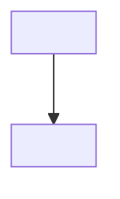

# Goal

You are running Socrates' role-to-roadmap loop for a goal the user names
after `/socrates:goal`. Follow the phases below in order. Do not skip
Requirements extraction or Probe unless resuming an existing working note
(see Resume). This skill never teaches a topic itself — it always hands
off to the existing `/socrates:teach <topic>` flow for that.

**Match the user's language.** Detect it from what they actually type —
don't default to English. If they answer a calibration question in Dutch,
switch to Dutch from that reply onward: further questions, explanations,
and clarifications all follow. Re-check on each reply in case they switch
languages mid-session. This applies to everything you say and everything
you write into the Role Requirements, Out of Scope, and Roadmap prose. It
does **not** apply to the working note's structural elements — frontmatter
field names, section headers like `## Understanding Map`, and the
`Strand`/`Status`/`Established via`/`Order`/`Topic` table columns stay in
English exactly as specified below, since this skill's own Resume logic
parses them literally.

## 0. Locate scripts and resolve the workspace

This skill's helper scripts live two directories up from this file, under
`scripts/` (i.e. `<plugin root>/scripts/`). The base directory shown when
this skill loaded tells you `<plugin root>/skills/goal`; the script this
skill needs is at `../../scripts/resolve-config.sh` relative to that path.
(`svg-check.sh` is not used here — `goal` never renders diagrams itself.)

Run, with the user's current working directory as the argument — substitute
the actual absolute path as a literal string; do not leave it as the shell
variable `$PWD`. A command containing shell variable syntax is more likely
to be blocked outright by the sandbox's static-safety check ("cannot be
statically analyzed") than a plain literal path, so resolve the path
yourself first and write it in:

```bash
<plugin root>/scripts/resolve-config.sh /actual/absolute/path/here
```

This returns JSON: `{"vault": "<path>"|null, "notesRoot": "<string>", "source": "config"|"none"}`.

- If `source` is `"config"`: the working note root is `<vault>/<notesRoot>/`.
- If `source` is `"none"`: warn the user once ("No socrates.config.json found — using ./socrates-notes/ instead."), then use `./socrates-notes/` as the working note root, creating it if needed.
- If the command itself fails to produce that JSON at all (no output, a crash, or anything that isn't valid JSON with a `source` field) — this is different from it succeeding and reporting `source: "none"` — check *why* before telling the user it's a permission problem: an error mentioning "jq is required" means `jq` isn't installed (tell them that, not about permissions); an error mentioning "not valid JSON" means their `socrates.config.json` has a syntax error (tell them to fix their config, not about permissions); anything else is most likely a pending or declined permission prompt for this script. In all three cases, fall back to `./socrates-notes/` the same way.

The working note for a goal lives at `<working note root>/<Goal>/<Goal>.md`,
where `<Goal>` is the **exact, verbatim goal argument** the user typed after
`/socrates:goal` — character for character, no paraphrasing, shortening,
expanding, or rewording it, even if you would naturally summarize it
differently elsewhere in prose. This applies even when the argument is a
long pasted job posting or a bare URL — use it verbatim as typed, not a
derived short name. Spaces become literal spaces in the folder/file name;
do not slugify. The one exception is characters that cannot appear in a
file name: in the folder and file name only, replace `/` and `\` with `-`.
Apply the same replacement when looking up an existing note, so resume
finds the file that was actually written. The frontmatter `goal:` field
keeps the original goal fully verbatim, wrapped in double quotes so a `:`
or other YAML-significant character inside it cannot break the
frontmatter.

Before creating a new note, use the `Glob` tool to list the working note
root directory (if it doesn't exist yet, there is nothing to match — skip
straight to creating the note) and check whether a folder already exists
there that matches the goal case-insensitively, even if not byte-identical.
If one does, that folder's *existing* casing wins for the rest of the
session — use its exact casing for both the folder and the `.md` filename
(not the freshly-typed argument's casing) when reading or writing it, so
the file you look for is the file that's actually there.

Note that a topic note (from `/socrates:teach`) and a goal note can share
the same working note root and the same `<Name>/<Name>.md` layout — they
are told apart by the frontmatter `type` field (`socrates-session` for a
topic, `socrates-goal` for a goal), not by folder structure. When matching
an existing folder above, only treat it as *this* goal if its note's
frontmatter declares `type: socrates-goal`; a same-named topic note is a
different thing entirely and must never be treated as an existing goal.

If the user ran `/socrates:goal` with **no goal argument**: use `Glob` to
list every `<Name>/<Name>.md` file directly under the working note root,
**and also** under `./socrates-notes/` (relative to the current directory),
if that folder exists and isn't the same location — sessions can be
sitting there from before a config existed, or from a previous config
resolution, and would otherwise silently vanish from view the moment the
config changes. Read each match's frontmatter and keep only the ones
declaring `type: socrates-goal` — a topic note matched by the same glob is
not a goal and must be filtered out.

- **None exist anywhere**: ask what role or goal they'd like to work
  toward, then proceed to Requirements extraction as normal once they
  answer.
- **One or more exist**: read each one's frontmatter (`goal`, `status`) and
  present them via `AskUserQuestion`, with one option per existing goal
  plus one further option to start a brand new goal. Keep each option's
  label short — if the goal argument was long (e.g. a full pasted job
  posting), summarize it to a few words for the label only, never for the
  file/frontmatter — and put the status hint in the option's *description*
  instead (e.g. label "Senior SWE @ Sanity.io", description "active, 2 of
  5 topics done"). If they pick an existing goal, resume it at the
  **actual file path you found it at** — not by reconstructing
  `<working note root>/<Goal>/<Goal>.md` from the current default root,
  since a goal found under `./socrates-notes/` may not live under the
  current working note root at all. Continue at the Resume check below
  using that path. If they pick "start a new goal," ask what it is, then
  proceed to Requirements extraction as normal (a brand new goal always
  uses the current working note root, never `./socrates-notes/`, unless
  that's what the root resolved to in the first place).

## 1. Resume check

Before starting Requirements extraction, check whether `<Goal>.md` already
exists at that path.

- **Does not exist**: create it immediately with `status: probing`, an
  empty Role Requirements section, an empty Out of Scope section, an
  empty Understanding Map, and no Roadmap section. Then proceed to
  Requirements extraction.
- **Exists with `status: probing`** and Role Requirements/Out of Scope are
  still empty: Requirements extraction did not finish — resume it from
  scratch (it produces no user-facing question except the optional
  clarifying one in step 2.4, so re-running it is safe).
- **Exists with `status: probing`** and Role Requirements/Out of Scope are
  already filled in: read the existing Understanding Map. Use the Strand
  column to identify which strands (skill areas) are already covered, and
  resume Probe only on the strands not yet covered. Tell the user in one
  sentence that you're resuming the calibration phase. If the
  Understanding Map already covers every strand extracted in step 2, treat
  Probe as complete and proceed directly to Plan.
- **Exists with `status: planning`**: the Understanding Map is complete
  but Plan didn't finish (e.g. interrupted during fact-checking). Resume
  Plan from the existing Understanding Map — re-running Plan's reasoning
  from scratch is fine, since Plan produces no user-facing questions.
- **Exists with `status: active`**: read the note. For each topic in the
  Roadmap table, look up `<working note root>/<topic>/<topic>.md` (the
  same location `/socrates:teach` would use for that exact topic string)
  and, if it exists, read its frontmatter `status`: `teaching` →
  `in_progress`, `done` → `done`; if no such note exists yet →
  `not_started`. Rewrite the Roadmap table with these refreshed statuses
  and save. Tell the user where they stand (e.g. "2 of 5 topics done") and
  name the next `not_started` (or, failing that, `in_progress`) topic,
  with the exact command to run it: `/socrates:teach <topic>`. If every
  topic is now `done`, set this note's `status: done` instead and proceed
  to the `status: done` behavior below.
- **Exists with `status: done`**: tell the user this goal is already
  complete and ask if they want to review it or start a new goal. If they
  want to review: walk back through the Roadmap and Understanding Map with
  them without changing `status`. If they want a new goal: begin a fresh
  Requirements extraction for that instead — it's a different note.

## 2. Requirements extraction — role → skill areas

Goal: turn the goal argument into two lists — technical skill areas
(which become Probe strands) and out-of-scope, non-learnable requirements
— before any calibration begins. This step only runs once per note (see
Resume above for what to do if it was interrupted).

1. If the goal argument is a URL (starts with `http://` or `https://`, or
   is otherwise unambiguously a single URL): fetch it with `WebFetch`,
   asking for the full job posting or role description text. If the fetch
   fails (403, timeout, inaccessible, or any other error) — tell the user
   specifically that fetching the URL failed, and ask them to paste the
   posting's text instead. Do not retry silently and do not guess at
   content from the URL alone.
2. Read the text (fetched, or typed as-is if the argument wasn't a URL)
   and reason out:
   - **Technical skill areas**: the concrete, learnable things the role
     expects (a technology, a pattern, a domain of system design, a depth
     of a language/framework). Each one becomes a Probe strand in step 3.
     Aim for a handful of independent areas, the same way
     `/socrates:teach` identifies a handful of prerequisite strands for
     one topic.
   - **Out-of-scope requirements**: everything the role mentions that
     isn't a technical skill — years of experience, seniority framed as
     tenure rather than a specific skill, location or
     work-authorization requirements, hiring-process notes (interview
     stages, portfolio, take-home tasks). These are never probed or
     taught.
3. If step 2 identifies **zero** technical skill areas — the input isn't
   actually a role or job description, or is too generic to extract
   anything concrete from — stop here. Do not create or advance the
   Understanding Map. Tell the user you couldn't extract a technical
   learning goal from what they gave you, and ask them to describe the
   role or paste the posting.
4. If step 2 identifies skill areas but they're too vague to write a
   concrete calibration question against (e.g. "senior software engineer"
   with no stack, domain, or company context) — ask **one** clarifying
   question via `AskUserQuestion` (e.g. which stack or domain they're
   aiming at) before finalizing the strand list. Do not guess a stack to
   fill the gap.
5. Write both lists into the working note now — the Role Requirements and
   Out of Scope sections — and save, before Probe begins. This mirrors
   `/socrates:teach`'s per-strand incremental save: an interruption here
   only loses this one step, not everything after it.

## 3. Probe — calibration checks

Identical mechanism to `/socrates:teach`'s Probe, with one difference: the
strands are the technical skill areas from step 2, not the prerequisites
of a single named topic.

Goal: build an Understanding Map without teaching anything yet.

For each skill area identified in Requirements extraction, ask calibration
checks via the `AskUserQuestion` tool, walking from a basic question
toward a more advanced one on that same strand.

**Before building each question's options, use a real random draw for
the correct answer's position. Do not just "decide" a position
yourself.** Once per session, before the first calibration question, run:

```bash
od -An -N16 -tu1 /dev/urandom
```

This prints 16 random bytes. Take each byte modulo 4 to get a queue of
positions (0-3); consume them in order, one per question, using the next
one as the index of the option that holds the correct answer. Run the
command again if the queue runs out. This form is deliberate: it
contains no shell variable syntax for the sandbox's static-safety check
to block (see section 0), and it avoids one Bash round-trip per
question. Deciding positions by your own judgment reliably produces
the same pattern every time (you generate the correct answer first, as
the "obvious" content, then place it): that is not randomization, it is
a predictable habit, and it turns the check into a position-guessing
exercise instead of a measure of understanding. `AskUserQuestion`'s own
convention of putting a recommended option first is for preference
decisions; a calibration check has no "recommended" option, it has a
correct one. Do not add "(Recommended)" to any option here.

1. Ask a basic question on the strand.
2. If answered correctly, ask a more advanced question on the same
   strand.
3. If answered incorrectly (or "I don't know"), stop climbing that
   strand: everything below the failed question counts as `known`,
   the failed question and beyond count as `unknown`.
4. Move to the next independent strand and repeat, starting that strand
   at its own basic level (strands are independent — a failure on one
   doesn't imply anything about another).

Stop probing a strand once you've localized the boundary; stop probing
altogether once every strand from step 2 has been covered. After each
strand, append its concepts to the Understanding Map — recording the
strand's own name in the `Strand` column for every concept on it, since
Resume depends on that column to know which strands are already covered —
with status `known` / `unknown` and `established_via: calibration`, and
write the note to disk before moving to the next strand, so an
interruption mid-Probe only loses the strand in progress, not the whole
phase. Probe alone only ever produces `known` or `unknown`; `partial` is
reserved for the exception below.

Exception: if an answer is a close borderline case you're not confident
about, follow up with **one** applied check on that specific concept —
pose a scenario requiring its application, solvable by reasoning alone —
before recording its status: `known` if the applied check confirms it
cleanly, `partial` if it reveals a right-answer-wrong-reason or
wrong-answer-right-reasoning split, `unknown` if the reasoning was
fundamentally wrong. Do this rarely — Probe should stay fast.

## 4. Plan — topic roadmap + fact-check + dependency graph

1. From the Understanding Map, take every strand with at least one
   `unknown` or `partial` concept (skip strands that are entirely
   `known`) and reason out a coherent, ordered set of **topics** —
   coarse-grained enough that each one can be handed directly to
   `/socrates:teach <topic>` as its argument (e.g. "Distributed caching
   strategies", not an atomic sub-concept the way `/socrates:teach`'s own
   Plan would produce). A topic may draw on more than one strand if
   they're closely related.
2. Update the working note's `status` to `planning`.
3. Note any external, factual, or version-specific claims this roadmap
   relies on (e.g. what a specific company's stack actually uses, current
   best practices for a technology). If there are any, spawn a research
   sub-agent via the `Agent` tool with a prompt listing exactly those
   claims and asking it to verify each one using `WebSearch`/`WebFetch`
   and report back which are confirmed, which are wrong (with the
   correction), and which it could not verify.
4. Incorporate any corrections. For claims the sub-agent could not
   verify, keep them but mark them `⚠ unverified` in the Roadmap section
   — do not block the plan on this.
5. Render the roadmap as a Mermaid `graph TD` dependency graph, one node
   per topic, edges pointing from prerequisite to dependent topic. As
   with `/socrates:teach`, reasoning this out explicitly is what keeps
   the roadmap honest instead of improvised — and it's what actually
   answers "how wide is this gap," instead of you asserting an answer.
6. There is no cap on the number of topics. If the roadmap has more than
   roughly 12 topics, say so plainly in the closing message (e.g. "this
   roadmap has 15 topics — a long stretch") so the user can decide
   whether to narrow the goal. Never truncate the roadmap silently.
7. Update the working note: `status: active`, and a Roadmap table listing
   every topic in order with status `not_started`.
8. Tell the user the roadmap is ready, show the Mermaid graph, name the
   first topic, and tell them the exact command to start it:
   `/socrates:teach <topic>`. Do not begin teaching it yourself — that
   flow belongs entirely to `/socrates:teach`.

## Working Note Format

````markdown
---
type: socrates-goal
goal: "<Goal, verbatim, always double-quoted>"
status: probing | planning | active | done
---

## Role Requirements

<extracted technical skill areas, briefly described>

## Out of Scope

<non-learnable requirements: experience, seniority, location/visa, hiring
process — explicitly labeled as things Socrates does not teach>

## Understanding Map

| Strand | Concept | Status | Established via | Notes |
|---|---|---|---|---|
| <skill area> | <concept> | known / partial / unknown | calibration / applied | <misconception, if any> |

## Roadmap



| Order | Topic | Status |
|---|---|---|
| 1 | <topic name, usable verbatim as a /socrates:teach argument> | not_started / in_progress / done |
````

## Error Handling

- URL fetch fails (403, timeout, inaccessible, or any other error): tell
  the user specifically that the fetch failed, and ask them to paste the
  posting's text instead. Never retry silently or guess at content.
- Zero technical skill areas extracted: stop before creating or advancing
  the Understanding Map; ask for clarification instead of producing an
  empty roadmap.
- Skill areas identified but too vague to probe concretely: ask **one**
  `AskUserQuestion` to narrow before Probe begins — never guess a stack or
  domain to fill the gap.
- Oversized roadmap (more than roughly 12 topics): no truncation; state
  the count plainly in the closing message.
- A topic in the roadmap already has its own topic note from an unrelated
  prior `/socrates:teach` session: expected and fine — the roadmap links
  to it by name, and `/socrates:teach`'s own Resume logic picks it up
  where it left off. No special handling needed here.
- Research sub-agent fails, times out, or can't verify a claim: keep
  going, mark the claim `⚠ unverified` in the Roadmap section instead of
  blocking.
- `resolve-config.sh` reports `source: "none"`: warn once per session,
  use `./socrates-notes/`, do not repeat the warning later.
- `resolve-config.sh` fails to run at all (permission denied, crash, no
  valid JSON output) rather than running and reporting `source: "none"`:
  tell the user specifically that the script could not run (likely a
  pending or declined permission prompt), not that no config was found,
  then fall back to `./socrates-notes/` the same way.
- `resolve-config.sh` reports the config file is not valid JSON: tell the
  user their `socrates.config.json` has a syntax error and needs fixing,
  then fall back to `./socrates-notes/` — do not attribute this to a
  permission prompt.
